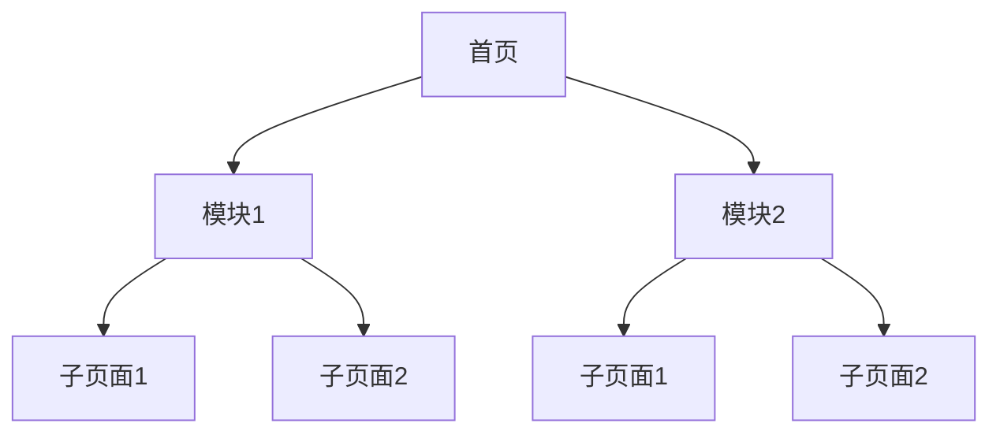
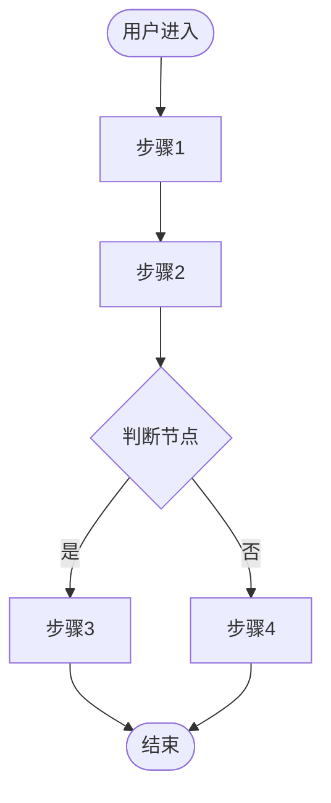
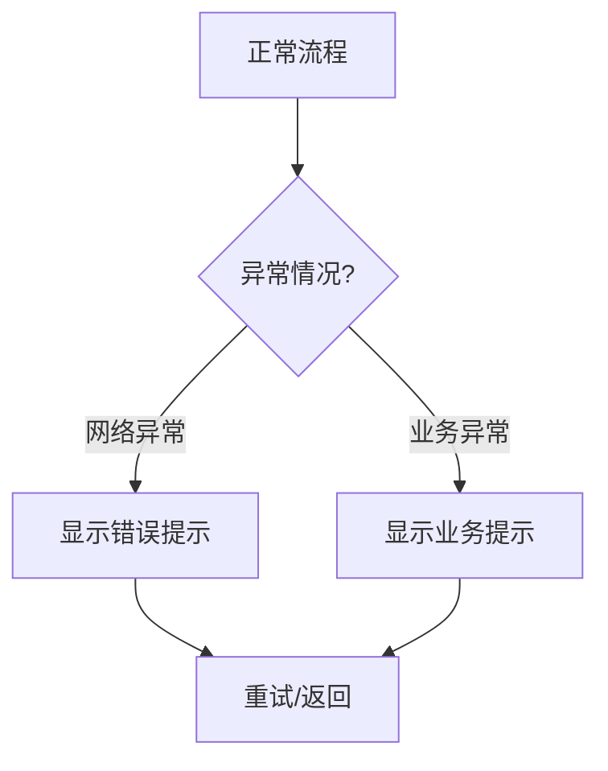

# [项目名称] - 设计需求文档

> 文档版本：v1.0  
> 更新时间：YYYY-MM-DD  
> 文档类型：设计需求文档

---

## 一、项目背景与设计目标

### 1.1 项目背景

[从PRD中提取项目背景,说明产品定位、核心价值]

### 1.2 设计目标

| 目标维度 | 具体指标 |
|---------|---------|
| **体验目标** | [具体的体验目标,如降低使用门槛、提升沉浸感等] |
| **业务目标** | [具体的业务指标,如日活、留存、转化率等] |
| **品牌目标** | [品牌认知、品牌形象等目标] |

### 1.3 核心设计挑战

[列出3-5个核心设计挑战,如:]
1. **挑战1**: [具体挑战描述]
2. **挑战2**: [具体挑战描述]
3. **挑战3**: [具体挑战描述]

---

## 二、用户角色与场景

### 2.1 用户画像

| 用户类型 | 特征 | 核心诉求 | 使用场景 |
|---------|------|---------|---------|
| **用户A** | [人口统计特征、行为特征] | [核心需求、痛点] | [典型使用场景] |
| **用户B** | [人口统计特征、行为特征] | [核心需求、痛点] | [典型使用场景] |

### 2.2 核心使用场景

#### 场景1：[场景名称]
> [详细描述用户在什么情况下、如何使用产品、完成什么任务]

#### 场景2：[场景名称]
> [详细描述用户在什么情况下、如何使用产品、完成什么任务]

---

## 三、信息架构

### 3.1 整体信息架构图



### 3.2 页面层级结构

```
L1 首页
├── L2 模块1
│   ├── L3 子页面1
│   └── L3 子页面2
└── L2 模块2
    └── L3 子页面1
```

---

## 四、核心交互流程

### 4.1 主流程交互流程图



### 4.2 异常流程处理



---

## 五、关键交互细节定义

### 5.1 [模块名称]交互

#### 状态展示逻辑

| 状态 | 视觉表现 | 交互反馈 |
|------|---------|---------|
| **状态1** | [具体视觉样式] | [点击/滑动等交互反馈] |
| **状态2** | [具体视觉样式] | [点击/滑动等交互反馈] |

#### 交互细节

- **触发条件**: [具体触发条件]
- **动画效果**: [动画类型、时长]
- **反馈方式**: [震动、声音、视觉反馈]

---

## 六、页面布局规范

### 6.1 [页面名称]布局结构

```
┌─────────────────────────────────┐
│        顶部导航区（固定）          │
├─────────────────────────────────┤
│        内容区（可滚动）            │
│                                 │
│                                 │
│                                 │
├─────────────────────────────────┤
│        底部操作区（固定）          │
└─────────────────────────────────┘
```

### 6.2 组件布局规范

| 组件 | 尺寸 | 间距 | 对齐方式 |
|------|------|------|---------|
| **按钮** | [宽x高] | [上下左右间距] | [居中/左对齐等] |
| **卡片** | [宽x高] | [上下左右间距] | [居中/左对齐等] |

---

## 七、视觉风格定义

### 7.1 色彩体系

| 色彩类型 | 色值 | 用途 |
|---------|------|------|
| **主色** | #XXXXXX | 主要按钮、重要元素 |
| **辅助色** | #XXXXXX | 次要元素、辅助信息 |
| **成功色** | #XXXXXX | 成功状态、正向反馈 |
| **失败色** | #XXXXXX | 失败状态、负向反馈 |

### 7.2 字体规范

| 层级 | 字号 | 字重 | 用途 |
|------|------|------|------|
| **H1** | XXpx | Bold | 页面标题 |
| **H2** | XXpx | Semi Bold | 模块标题 |
| **Body** | XXpx | Regular | 正文内容 |

### 7.3 图标规范

- **图标尺寸**: 统一尺寸XXxXXpx
- **图标风格**: 线性/面性
- **描边粗细**: Xpx

---

## 八、异常状态处理

### 8.1 网络异常

| 场景 | 处理方式 |
|------|---------|
| 数据加载失败 | 显示占位图 + [重新加载]按钮 |
| 提交失败 | Toast提示"网络不给力,请重试" |

### 8.2 业务异常

| 场景 | 处理方式 |
|------|---------|
| 无权限 | 提示"暂无权限访问" + [申请权限]按钮 |
| 数据为空 | 显示空状态图 + [刷新/返回]按钮 |

---

## 九、埋点需求

### 9.1 核心埋点事件

| 事件名称 | 触发时机 | 关键参数 |
|---------|---------|---------|
| `page_view` | 进入页面 | user_id, page_name |
| `button_click` | 点击按钮 | button_name, page_name |
| `form_submit` | 提交表单 | form_type, form_data |

---

## 十、设计交付清单

### 10.1 设计稿交付

| 页面 | 数量 | 备注 |
|------|------|------|
| [页面名称] | X套 | 含X个状态 |

### 10.2 规范文档交付

- [ ] 色彩规范
- [ ] 字体规范
- [ ] 图标规范
- [ ] 组件规范

### 10.3 原型交付

- [ ] 高保真原型
- [ ] 可交互原型

---

## 十一、设计风险评估

| 风险点 | 风险等级 | 应对方案 |
|--------|---------|---------|
| [风险描述] | 高/中/低 | [具体应对措施] |

---

## 附录:关键术语表

| 术语 | 定义 |
|------|------|
| **术语1** | [定义说明] |
| **术语2** | [定义说明] |
