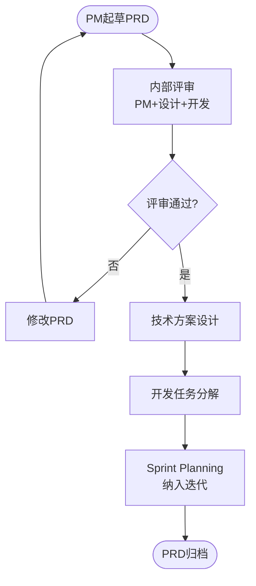
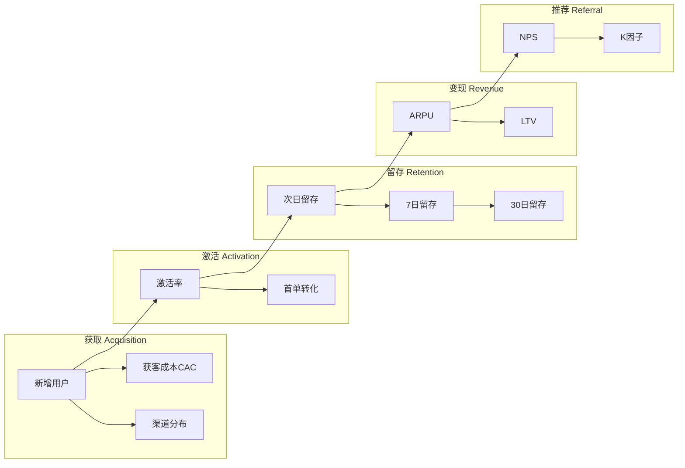
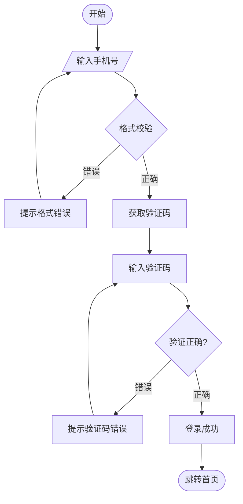
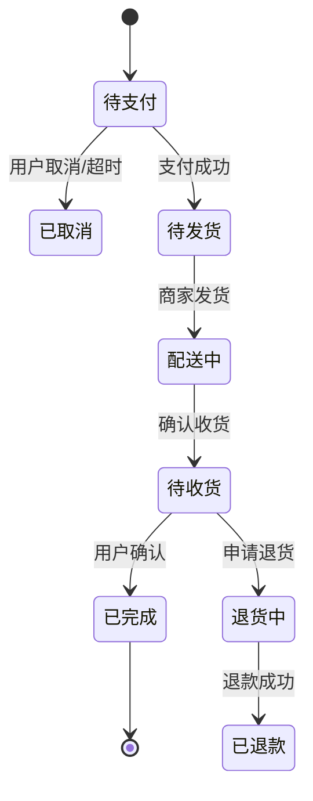
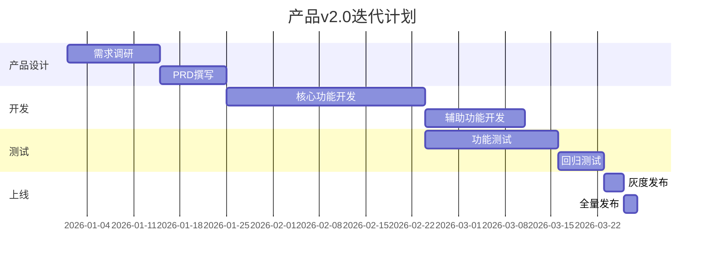
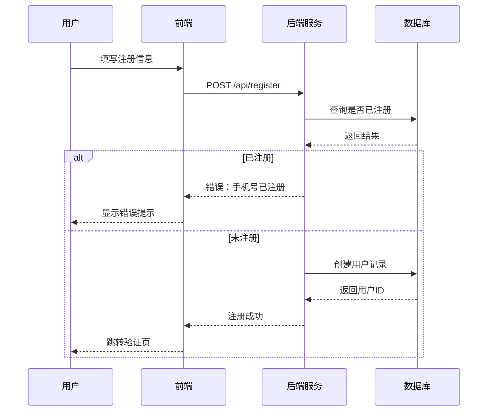
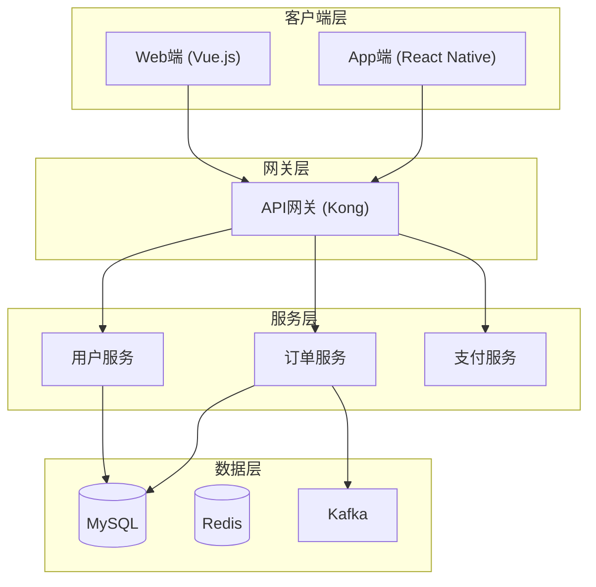
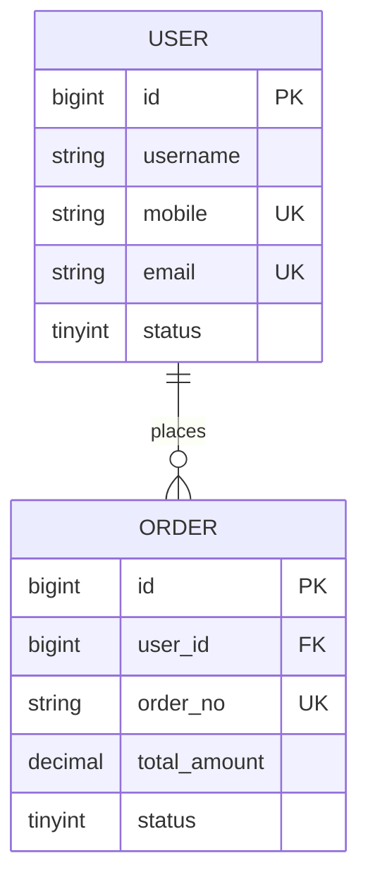
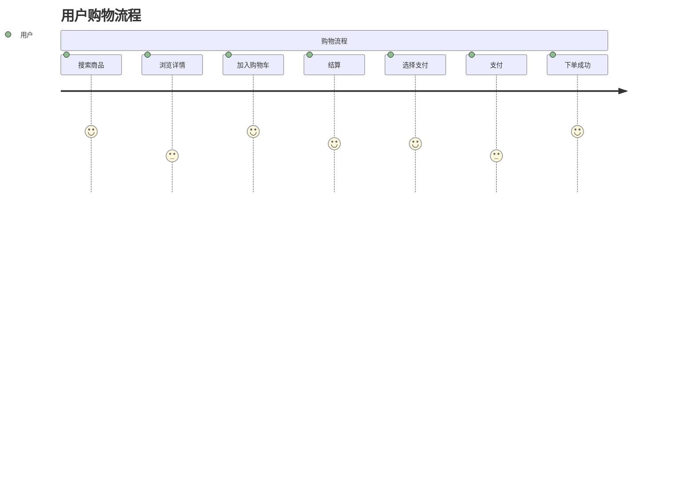

# 软件产品经理（Product Manager）知识技能

> 使用场景：用户需要产品经理级别的专业支持，或询问产品经理相关知识。
> 注意：本 skill 采用主动式产品咨询流程，不是单向知识问答。
> 流程：确认需求 → 提问澄清 → 网络搜索 + RAG搜索 → 产品规划 → 方案对比（用户选择） → 需求确认 → PRD文档输出 + Mermaid图表整合 → 导出格式选择 → H5可交互原型图（可选，PRD后主动询问，所有页面集成在同一HTML文件，本地Tailwind CSS内联）。

## 可选依赖

- DOCX 导出需要 `python3` 和 `python-docx`。
- Mermaid 渲染需要 `node`、`npm`、`@mermaid-js/mermaid-cli`，以及 Chrome、Edge、Firefox 或 Chromium 之一。
- 如果只输出 Markdown PRD，可以跳过这些依赖。

---

# 主动式产品咨询流程

本 skill 不做单向知识问答，而是遵循以下流程：确认需求 → 提问澄清 → 网络搜索 + RAG资料搜索 → 产品规划 → 方案对比 → 技术选型 → 需求确认 → PRD文档 + Mermaid图表 → 导出格式 → H5原型图（可选）。

## 阶段一：确认需求（开口三问）

收到用户产品相关需求后，先用一段话确认理解，然后问三个核心问题：

**问题1：产品方向**
「你这个产品主要是做什么的？面向什么用户？解决什么核心问题？」

**问题2：平台形态**
「是移动端APP、小程序、Web端还是多端都要？C端还是B端？」

**问题3：成熟度**
「现在是从0到1的新产品，还是在现有产品上做迭代？有没有竞品可以参照？」

## 阶段二：多源资料搜索

根据用户回答，判断需要搜索哪些资料。可以灵活选择一种或两种方式组合使用：

### 2.1 网络搜索

**搜索策略**：优先使用环境中最可靠的网络搜索工具（由系统自动选择）。若返回结果为空或结果数 ≤ 2，应立即尝试其他可用搜索工具。**禁止在提示词中硬编码具体搜索工具名**。

**降级触发条件**（满足任一即换工具重试）：
- 搜索返回结果数 ≤ 2
- 搜索耗时异常长（>5s 无响应）
- 工具返回"不可用"或报错

示例搜索调用：
```
搜索「运动健身APP用户需求分析 2026」
搜索「装修APP用户痛点 业主 2026」
搜索「住小帮 齐家网 土巴兔 功能对比」
```
*若第一个搜索工具返回不足，自动切换其他工具重试*

### 2.2 RAG本地搜索

使用 `WebFetch` 工具获取官方文档，或用 `Grep`/`Read` 工具搜索本地参考文档。

**本地文档映射：**
- 需求分析类 → 调取 `pm-responsibilities.md`、`sdlc-product-process.md`
- 产品设计类 → 调取 `prd-template.md`、`mermaid-guide.md`
- 竞品分析类 → 调取 `pm-framework.md`（竞品分析框架）
- 数据分析类 → 调取 `pm-framework.md`（AARRR/留存分析）
- 路线图规划类 → 调取 `pm-framework.md`（OKR对齐）、`sdlc-product-process.md`

## 阶段三：产品规划

基于网络搜索结果和RAG资料，给出产品规划建议，包括：

**产品定位一句话**：「[产品名称]是一个面向[目标用户]的[产品类型]，解决[核心问题]。*

**核心功能优先级**（MoSCoW）：
- Must（必须有）：[核心路径功能，1-3个]
- Should（应该有）：[重要功能，2-4个]
- Could（可以有）：[增强功能，2-3个]
- Won't（这次不做）：[放未来规划的功能]

**MVP范围定义**：最小可行产品只做哪几个功能，为什么这几个是核心。

**用户旅程简化版**：
```
用户打开APP → [核心动作] → [得到什么价值] → [下一个动作/退出]
```

## 阶段四：方案对比（用户选择）

基于产品规划结果，输出2-3个不同方案供用户选择。

**方案命名**：「简约版」「标准版」「增强版」或「A方案」「B方案」「C方案」

**方案对比表**：
| 维度 | 方案A（简约版） | 方案B（标准版） | 方案C（增强版） |
|------|----------------|----------------|----------------|
| 功能范围 | MVP核心功能 | 核心+重要功能 | 全功能 |
| 开发周期 | 约X人天 | 约X人天 | 约X人天 |
| 技术复杂度 | 低 | 中 | 高 |
| 适用场景 | 快速验证 | 成熟产品 | 完整规划 |

**各方案详细说明**：
- 方案A：只做核心路径，快速上线验证
- 方案B：在核心基础上增加重要辅助功能
- 方案C：完整规划，包含所有规划功能

**用户决策**：等待用户选择某个方案，或提出修改意见。

## 阶段五：技术选型确认

用户选定方案后，输出技术选型确认，确认以下内容：

**技术栈确认**：
| 分类 | 选项 | 说明 |
|------|------|------|
| 前端框架 | React / Vue / 纯H5 | 影响H5原型实现方式 |
| 后端框架 | Node.js / Python / Java / Go | 影响API设计 |
| 数据库 | MySQL / PostgreSQL / MongoDB | 影响数据模型设计 |
| 部署方式 | 云服务 / 自建服务器 | 影响运维方案 |

**技术约束确认**：
- 是否有现成技术栈要求？
- 是否有性能/并发/安全等技术要求？
- 第三方服务依赖（支付/地图/推送等）？

**技术选型确认话术**：
```
请确认技术选型方向：
   - 前端技术栈偏好（React/Vue/纯H5）
   - 后端技术栈偏好（Node.js/Python/Java/Go）
   - 数据库选型（关系型/文档型）
   - 是否有现成框架或技术债务需继承
   - 第三方服务依赖（支付/地图/推送等）
```

确认后进入需求确认阶段。如用户跳过，则使用合理默认值继续。

## 阶段六：需求确认

用户选定方案后，在正式输出PRD文档之前，先输出一份**需求确认书**，包含：

### 需求确认书模板
```
## 需求确认书（确认后进入PRD输出）

**产品名称**：[名称]
**选定方案**：[方案A/方案B/方案C]
**平台形态**：[APP/小程序/H5/Web端]

### 核心功能确认
| 功能模块 | 功能名称 | 优先级 | 确认 |
|---------|---------|--------|------|
| [模块] | [功能] | P0 | [✓/—] |

### 关键业务流程确认
[描述1-2个核心用户路径]

### 目标指标确认
| 指标 | 目标值 | 周期 |
|------|--------|------|
| [DAU/留存率/转化率等] | [数值] | [时间] |

### Mermaid图表预览
[产品架构图 / 用户旅程图]

**请确认以上内容是否准确，如有调整请告知，确认后输出完整PRD文档。**
```

确认完成后进入PRD输出阶段。如用户有调整，返回阶段三重新规划。

## 阶段七：PRD文档整合输出

整合网络搜索和RAG资料，输出完整PRD文档。如果用户明确要求保存，再使用 Write 工具保存文档。

### 询问存放路径

**在输出PRD文档之前，必须先询问用户存放路径。**

```
在开始输出PRD文档之前，请告诉我：
1. 存放文件夹路径（例如：`~/PRD/` 或 `D:\project\PRD` 或 `~/Desktop/`）
2. 文件命名（例如：`装修APP_PRD_v0.1`）

如果暂时不想保存，可以回复「不保存」，我会直接在回复中输出完整文档内容。
```

- 用户指定路径后，使用 Write 工具保存文件
- 用户未指定 → 在回复末尾输出完整文档内容，并说明「可保存为 `~/[用户主目录]/[产品名称]_PRD_v0.1.md`」
- **禁止硬编码用户-specific路径**（如 `C:\Users\yhong\...`）

### 文件保存规范

**不要在 skill 中硬编码用户-specific 的路径。** PRD 文档的保存路径应该由用户在对话中指定，或者使用通用的相对路径。如果用户没有指定保存位置，则在输出时说明「如需保存，请在下方复制文档内容」。

不正确的做法（会导致跨平台不兼容）：
`/home/{用户名}/projects/{产品名称}/PRD/...` 或 `C:\\Users\\{用户名}\\projects\\{产品名称}\\PRD\\...`

这些都是用户-specific 路径，不应在 skill 中出现。

正确的做法（跨平台通用）：
- 如果用户指定了路径，按用户指定路径保存
- 如果用户未指定，在回复末尾提供文档内容供用户复制，并说明「可保存为 `~/projects/{产品名称}/PRD/{产品名称}_PRD_v0.1.md`」
- Windows/WSL/macOS 用户可各自替换 `~` 为自己的主目录路径

### PRD文档模板

```markdown
# [产品名称] 产品需求文档 v0.1

## 1. 概述

### 1.1 背景
[为什么做这个产品，基于市场分析和用户需求]

### 1.2 产品定位
[一句话产品定位]

### 1.3 目标用户
[用户画像描述]

### 1.4 成功标准
| 指标 | 当前值 | 目标值 | 时间节点 |
|------|--------|--------|---------|
| [指标名] | [数值] | [数值] | [日期] |

### 1.5 竞品分析
[基于网络搜索的竞品对比]

### 1.6 参考资源
- [竞品官网/文章链接]
- [行业报告链接]

## 2. 用户与场景

### 2.1 用户画像
[用户画像描述：基本信息/使用场景/痛点/动机]

### 2.2 用户旅程
[文字描述关键步骤]

### 2.3 核心用例
| 用例编号 | 用例名称 | 触发条件 | 主路径 | 预期结果 |
|---------|---------|---------|--------|---------|
| UC-01 | [名称] | [条件] | [步骤] | [结果] |

## 3. 功能需求

### 3.1 功能列表
| 功能模块 | 功能名称 | 优先级 | 描述 |
|---------|---------|--------|------|
| [模块] | [功能] | P0 | [一句话描述] |

### 3.2 详细说明
[针对P0核心功能，详细描述功能逻辑]

### 3.3 验收标准
| 功能 | 验收条件 | 测试方法 |
|------|---------|---------|
| [功能] | [SMART标准] | [测试步骤] |

## 4. 非功能需求
| 类型 | 要求 |
|------|------|
| 性能 | [响应时间要求] |
| 安全 | [安全要求] |
| 兼容性 | [兼容要求] |
| 可靠性 | [可用性要求] |

## 5. 数据埋点
| 事件名称 | 触发时机 | 参数 |
|---------|---------|------|
| [事件] | [时机] | [参数] |

## 6. 风险与依赖
| 风险/依赖 | 影响 | 应对措施 |
|-----------|------|---------|
| [条目] | [描述] | [措施] |

## 7. 附录
- 修订记录
- 术语表
```

## 阶段八：Mermaid图表整合输出

**从0到1新产品** → 输出：
- 产品架构图（系统分层）
- 核心用户旅程图
- MVP功能优先级甘特图

**迭代类产品** → 输出：
- 需求状态流转图
- 迭代计划甘特图
- 跨团队协作时序图（PM/设计/开发/QA）

**竞品分析类** → 输出：
- 功能对比矩阵表
- 竞品架构对比图

**数据分析类** → 输出：
- AARRR漏斗图
- 用户留存曲线

---

## 阶段九：导出格式选择

在PRD文档输出完成后，主动询问用户导出格式。

### 询问话术

```
✅ PRD文档已完成，请选择导出格式：
   - 输入「md」或「Markdown」→ 保存为 .md 文件
   - 输入「docx」或「Word」→ 保存为 .docx 文件（Mermaid图表自动渲染为PNG图片）
   - 输入「不需要」→ 跳过导出
```

### 导出方式

**Markdown（.md）**：直接保存为 `.md` 文件，Mermaid图表保留为代码块格式。

**Word（.docx）**：
- 使用 `python-docx` 库生成 `.docx` 文件
- Mermaid代码块自动渲染为PNG图片后嵌入文档
- 使用本地浏览器（Chrome/Edge/Firefox 之一）+ puppeteer渲染Mermaid（自动检测可用浏览器）
- 渲染脚本：`scripts/prd_export.py`（调用 `scripts/mermaid_render_multi.js`）

**命令示例**：
```bash
# 导出为 docx（Mermaid自动转PNG）
python3 scripts/prd_export.py PRD文档.md 输出 PRD文档.docx

# 导出为 md（直接复制内容）
# 在输出中提供 .md 文件内容
```

---

## 阶段十：H5可交互原型图（可选，导出后主动询问）

**触发时机**：在PRD文档输出完成后，主动询问用户：「是否需要生成H5可交互原型图？」

### 询问话术

```
✅ PRD文档已完成，是否需要生成H5可交互原型图？
   - 输入「需要」或「是」→ 生成原型图
   - 输入「不需要」或「否」→ 结束流程

如果需要生成H5原型图，请同时告诉我存放路径（例如：`~/Desktop/` 或 `D:\project\`），原型图将保存为 `{产品名称}_prototype.html` 文件。
```

### 技术约束

**语言限制**：纯 HTML + CSS + JavaScript（原生），不使用 Vue、React、Angular 或任何框架。

**零外部依赖**：生成的 HTML 不依赖任何外部 CDN、网络资源或 npm 包。Tailwind CSS 通过脚本预下载并内联到 HTML 中，图标以内联 SVG 嵌入，字体使用系统默认字体。

### Tailwind CSS 本地化流程

生成原型图前，无需准备 Tailwind CSS，直接在 HTML 中使用 CDN 链接 `<script src="https://cdn.tailwindcss.com"></script>` 即可。

**第四步：生成 HTML**

生成 HTML 时，直接使用 CDN 链接，`<script>` 标签自带加载容错：

```html
<!DOCTYPE html>
<html lang="zh-CN">
<head>
  <meta charset="UTF-8">
  <meta name="viewport" content="width=device-width, initial-scale=1.0, maximum-scale=1.0, user-scalable=no">
  <title>页面标题</title>
  <!-- Tailwind CSS CDN，直接引用，无需本地文件 -->
  <script src="https://cdn.tailwindcss.com"></script>
  <style>
    /* 页面特定样式 */
  </style>
</head>
<body class="bg-gray-100">
  <!-- 页面内容 -->
  <script>
    // 交互逻辑
  </script>
</body>
</html>
```

**关键原则**：
- **直接使用 CDN**：`<script src="https://cdn.tailwindcss.com">` 是最可靠的方式，无需本地文件
- **禁止内联 ~350KB CSS**：不再要求将整个 tailwind.css 内联到 `<style>` 标签
- **跨平台零配置**：CDN 链接在 Windows/macOS/Linux 下均有效，无需路径适配

### 页面结构规范

**单HTML文件**：所有页面集成在同一个HTML文件中，使用tab/section切换展示不同页面。

**文件名命名**：`{产品名称}_prototype.html`

**核心交互原则**：所有页面存在于同一个HTML文件中，页面之间的跳转通过 `showPage()` 函数切换 `section` 的显示/隐藏状态来实现，不依赖多文件或服务器。

**UI设计规范**：
- **视觉层次**：使用 `shadow-sm`/`shadow-md` 给卡片增加层次感，不要只有纯底色
- **间距**：页面内 `p-4` 基础内边距，卡片之间使用 `space-y-3`（12px间距），组内元素 `space-y-4`（16px间距）
- **圆角**：卡片使用 `rounded-xl`（12px），按钮使用 `rounded-lg`（8px），输入框使用 `rounded-lg`
- **颜色**：`bg-white` 卡片搭配 `bg-gray-50` 背景形成对比，操作按钮使用主色 `bg-blue-500`/`bg-blue-600`
- **阴影**：`shadow-sm` 用于卡片，`shadow-lg` 用于弹窗/浮层
- **空状态**：列表为空时显示占位插图和提示文字
- **触摸反馈**：点击时使用 `active:bg-gray-100` 提升交互感

**页面组织方式**：
```html
<!-- 顶部Tab导航 -->
<div id="nav-tabs" class="flex border-b bg-white sticky top-0 z-10">
  <button onclick="showPage('login')" class="tab-btn active flex-1 py-3 text-center border-b-2 border-blue-500 text-blue-500 font-medium">登录</button>
  <button onclick="showPage('home')" class="tab-btn flex-1 py-3 text-center border-b-2 border-transparent text-gray-400 font-medium">首页</button>
  <button onclick="showPage('detail')" class="tab-btn flex-1 py-3 text-center border-b-2 border-transparent text-gray-400 font-medium">详情</button>
  <button onclick="showPage('profile')" class="tab-btn flex-1 py-3 text-center border-b-2 border-transparent text-gray-400 font-medium">我的</button>
</div>

<!-- 页面容器 -->
<div id="pages" class="pb-16">
  <section id="page-login" class="page active">
    <!-- 登录表单 -->
    <div class="p-6 space-y-5">
      <div class="text-center mb-6">
        <div class="w-16 h-16 bg-blue-500 rounded-2xl mx-auto mb-3 flex items-center justify-center shadow-lg">
          <span class="text-white text-2xl font-bold">LOGO</span>
        </div>
        <h1 class="text-xl font-bold text-gray-800">产品名称</h1>
        <p class="text-gray-400 text-sm mt-1">欢迎回来，请登录</p>
      </div>
      <input type="text" placeholder="请输入手机号" class="w-full border border-gray-200 rounded-xl px-4 py-3.5 bg-gray-50 focus:outline-none focus:ring-2 focus:ring-blue-500 focus:border-transparent transition" />
      <input type="password" placeholder="请输入密码" class="w-full border border-gray-200 rounded-xl px-4 py-3.5 bg-gray-50 focus:outline-none focus:ring-2 focus:ring-blue-500 focus:border-transparent transition" />
      <button onclick="showPage('home')" class="w-full bg-blue-500 text-white py-3.5 rounded-xl font-medium shadow-md hover:bg-blue-600 active:bg-blue-700 transition">登录</button>
      <p class="text-center text-sm text-gray-400">还没有账号？<span class="text-blue-500">立即注册</span></p>
    </div>
  </section>

  <section id="page-home" class="page hidden">
    <!-- 首页Banner + 列表 -->
    <div class="p-4 space-y-4">
      <!-- Banner轮播 -->
      <div class="bg-gradient-to-r from-blue-500 to-blue-600 rounded-2xl p-5 text-white shadow-lg">
        <p class="text-sm opacity-90">限时活动</p>
        <h2 class="text-lg font-bold mt-1">新人专享福利</h2>
        <p class="text-xs opacity-80 mt-1">点击领取专属优惠券</p>
      </div>
      <!-- 分类快捷入口 -->
      <div class="grid grid-cols-4 gap-3">
        <div class="flex flex-col items-center gap-1 py-2">
          <div class="w-10 h-10 bg-blue-50 rounded-xl flex items-center justify-center"><span class="text-base">📦</span></div>
          <span class="text-xs text-gray-500">分类</span>
        </div>
        <div class="flex flex-col items-center gap-1 py-2">
          <div class="w-10 h-10 bg-orange-50 rounded-xl flex items-center justify-center"><span class="text-base">🔥</span></div>
          <span class="text-xs text-gray-500">热榜</span>
        </div>
        <div class="flex flex-col items-center gap-1 py-2">
          <div class="w-10 h-10 bg-green-50 rounded-xl flex items-center justify-center"><span class="text-base">🎁</span></div>
          <span class="text-xs text-gray-500">福利</span>
        </div>
        <div class="flex flex-col items-center gap-1 py-2">
          <div class="w-10 h-10 bg-purple-50 rounded-xl flex items-center justify-center"><span class="text-base">✨</span></div>
          <span class="text-xs text-gray-500">精选</span>
        </div>
      </div>
      <!-- 列表项 -->
      <div onclick="showPage('detail')" class="bg-white rounded-xl p-4 shadow-sm cursor-pointer hover:shadow-md active:bg-gray-50 transition">
        <div class="flex gap-3">
          <div class="w-20 h-20 bg-gray-100 rounded-lg flex-shrink-0"></div>
          <div class="flex-1 min-w-0">
            <h3 class="font-medium text-gray-800 truncate">商品标题名称</h3>
            <p class="text-gray-400 text-xs mt-1 line-clamp-2">商品简短描述，介绍核心功能和卖点，最多显示两行</p>
            <div class="flex items-baseline gap-1 mt-2">
              <span class="text-red-500 font-bold">¥99</span>
              <span class="text-gray-300 text-xs line-through">¥199</span>
            </div>
          </div>
        </div>
      </div>
    </div>
  </section>

  <section id="page-detail" class="page hidden">
    <!-- 详情页 -->
    <div>
      <!-- 商品图片区域 -->
      <div class="bg-gray-100 h-64 flex items-center justify-center">
        <span class="text-gray-300 text-4xl">📷</span>
      </div>
      <!-- 商品信息 -->
      <div class="p-4">
        <div class="flex items-baseline gap-2">
          <span class="text-red-500 text-2xl font-bold">¥99</span>
          <span class="text-gray-400 text-sm line-through">¥199</span>
          <span class="text-orange-500 text-xs bg-orange-50 px-2 py-0.5 rounded">限时优惠</span>
        </div>
        <h1 class="text-lg font-bold text-gray-800 mt-3">商品标题名称</h1>
        <p class="text-gray-400 text-sm mt-2">这里是商品详细描述，包含核心卖点、功能介绍、规格参数等详细内容。</p>
        <!-- 标签 -->
        <div class="flex flex-wrap gap-2 mt-3">
          <span class="bg-blue-50 text-blue-500 text-xs px-2 py-1 rounded-full">正品保证</span>
          <span class="bg-green-50 text-green-500 text-xs px-2 py-1 rounded-full">急速发货</span>
          <span class="bg-purple-50 text-purple-500 text-xs px-2 py-1 rounded-full">售后无忧</span>
        </div>
      </div>
      <!-- 底部固定操作栏 -->
      <div class="fixed bottom-0 left-0 right-0 bg-white border-t px-4 py-3 flex gap-3 shadow-lg">
        <div class="flex items-center gap-1 text-gray-400">
          <svg class="w-5 h-5" fill="none" stroke="currentColor" viewBox="0 0 24 24"><path stroke-linecap="round" stroke-linejoin="round" stroke-width="2" d="M4.318 6.318a4.5 4.5 0 000 6.364L12 20.364l7.682-7.682a4.5 4.5 0 00-6.364-6.364L12 7.636l-1.318-1.318a4.5 4.5 0 00-6.364 0z"/></svg>
          <span class="text-xs">收藏</span>
        </div>
        <div class="flex items-center gap-1 text-gray-400">
          <svg class="w-5 h-5" fill="none" stroke="currentColor" viewBox="0 0 24 24"><path stroke-linecap="round" stroke-linejoin="round" stroke-width="2" d="M3 3h2l.4 2M7 13h10l4-8H5.4M7 13L5.4 5M7 13l-2.293 2.293c-.63.63-.184 1.707.707 1.707H17m0 0a2 2 0 100 4 2 2 0 000-4zm-8 2a2 2 0 11-4 0 2 2 0 014 0z"/></svg>
          <span class="text-xs">购物车</span>
        </div>
        <button onclick="showPage('home')" class="flex-1 py-3 bg-gray-100 text-gray-600 rounded-xl font-medium active:bg-gray-200 transition">加入购物车</button>
        <button class="flex-1 py-3 bg-blue-500 text-white rounded-xl font-medium shadow-md active:bg-blue-600 transition">立即购买</button>
      </div>
    </div>
  </section>

  <section id="page-profile" class="page hidden">
    <!-- 个人中心 -->
    <div class="p-4">
      <div class="bg-white p-4 rounded-xl shadow mb-4">
        <p class="text-gray-500">个人中心内容</p>
      </div>
      <button onclick="showPage('login')" class="w-full py-3 text-red-500 border border-red-500 rounded-lg">退出登录</button>
    </div>
  </section>
</div>

<style>
  .page { display: none; }
  .page.active { display: block; }
  .hidden { display: none !important; }
</style>

<script>
  function showPage(name) {
    // 隐藏所有页面
    document.querySelectorAll('.page').forEach(p => {
      p.classList.remove('active');
      p.classList.add('hidden');
    });
    // 显示目标页面
    const target = document.getElementById('page-' + name);
    if (target) {
      target.classList.remove('hidden');
      target.classList.add('active');
    }
    // 更新Tab高亮状态
    document.querySelectorAll('.tab-btn').forEach(btn => {
      if (btn.getAttribute('onclick').includes("'" + name + "'")) {
        btn.classList.add('border-blue-500', 'text-blue-500');
        btn.classList.remove('border-transparent', 'text-gray-500');
      } else {
        btn.classList.remove('border-blue-500', 'text-blue-500');
        btn.classList.add('border-transparent', 'text-gray-500');
      }
    });
    // 滚动到顶部
    window.scrollTo(0, 0);
  }

  // 支持浏览器前进后退
  window.addEventListener('popstate', () => {
    const hash = window.location.hash.replace('#', '') || 'login';
    showPage(hash);
  });
</script>
```

### 页面模板

```html
<!DOCTYPE html>
<html lang="zh-CN">
<head>
  <meta charset="UTF-8">
  <meta name="viewport" content="width=device-width, initial-scale=1.0, maximum-scale=1.0, user-scalable=no">
  <title>页面标题</title>
  <script src="https://cdn.tailwindcss.com"></script>
  <style>
    /* 页面特定样式 */
  </style>
</head>
<body class="bg-gray-100">
  <!-- 页面内容 -->
  <script>
    // 交互逻辑
  </script>
</body>
</html>
```

### 移动端适配要点

- viewport：`width=device-width, initial-scale=1.0, maximum-scale=1.0, user-scalable=no`
- 触摸目标最小 44×44px
- 设计基准宽度 750px（微信H5标准）
- 使用 `flex` 和 `space-y-*` 简化布局
- 底部固定导航使用 `fixed bottom-0`

### 页面导航

同一HTML文件内的页面通过 `showPage()` 函数切换不同 section 的显示状态实现跳转。不使用 `window.location.href`，不依赖多文件或服务器。

**页面间跳转规则**：
- 列表页 → 点击列表项 → 进入详情页（传 id 参数）
- 详情页 → 返回按钮 → 返回列表页（保留位置）
- 表单提交 → 成功后跳转至目标页
- 底部Tab → 点击直接切换Tab高亮并跳转对应页面

**传参方式（同一HTML内）**：
```js
// 使用 data 属性存储 id
<div onclick="goDetail(123)" class="list-item">商品A</div>

// 跳转时携带参数
function goDetail(id) {
  // 将当前页存入"上一页"堆栈，用于返回
  window.historyState = window.historyState || {};
  window.historyState.backPage = 'home';
  // 显示详情页（详情页根据全局变量或DOM状态读取id）
  window.currentDetailId = id;
  showPage('detail');
}

// 返回按钮使用
<button onclick="goBack()" class="fixed bottom-0 left-0">返回</button>

function goBack() {
  const back = window.historyState?.backPage || 'home';
  showPage(back);
}
```

**跨页面状态管理**：
```js
// localStorage 存储简单状态（登录态、用户信息）
localStorage.setItem('isLoggedIn', 'true');
localStorage.setItem('user', JSON.stringify({name: '张三'}));

// 页面显示时读取状态，决定展示什么内容
function showPage(name) {
  // ...切换页面逻辑...
  if (name === 'profile') {
    const user = JSON.parse(localStorage.getItem('user') || '{}');
    document.querySelector('#page-profile .username').textContent = user.name || '未登录';
  }
}
```

### 常用交互模式

**点击切换**：
```js
document.querySelectorAll('.tab-item').forEach(tab => {
  tab.addEventListener('click', () => {
    document.querySelectorAll('.tab-item').forEach(t => t.classList.remove('bg-blue-500', 'text-white'));
    tab.classList.add('bg-blue-500', 'text-white');
  });
});
```

**表单验证**：
```js
form.addEventListener('submit', (e) => {
  e.preventDefault();
  if (!input.value.match(/^1[3-9]\d{9}$/)) {
    alert('请输入正确手机号');
    return;
  }
  // 提交处理
});
```

**列表项点击**：
```js
document.querySelectorAll('.list-item').forEach(item => {
  item.addEventListener('click', () => {
    const id = item.dataset.id;
    window.location.href = `detail.html?id=${id}`;
  });
});
```

### 组件库（Tailwind CSS）

> Tailwind CSS 已预下载并内联到 HTML 中，无需任何外部依赖。

**按钮**：`px-6 py-2 bg-blue-500 text-white rounded-full`
**输入框**：`border rounded-lg px-4 py-2 w-full`
**卡片**：`bg-white rounded-xl shadow p-4`
**底部导航**：`fixed bottom-0 flex justify-around bg-white border-t`
**徽标**：`absolute -top-1 -right-1 bg-red-500 text-white text-xs rounded-full px-1.5 py-0.5`

### 图标使用（内联SVG）

**图标尺寸规范**：`w-5 h-5`（20×20px）或 `w-6 h-6`（24×24px）。**禁止使用 `w-8 h-8`（32px）或更大尺寸**——图标应与文字对齐，不应喧宾夺主。

常用图标以内联 SVG 方式嵌入，避免外部依赖：

```html
<!-- 返回箭头（推荐尺寸 w-5 h-5）-->
<svg class="w-5 h-5" fill="none" stroke="currentColor" viewBox="0 0 24 24"><path stroke-linecap="round" stroke-linejoin="round" stroke-width="2" d="M15 19l-7-7 7-7"/></svg>

<!-- 主页图标 -->
<svg class="w-5 h-5" fill="none" stroke="currentColor" viewBox="0 0 24 24"><path stroke-linecap="round" stroke-linejoin="round" stroke-width="2" d="M3 12l2-2m0 0l7-7 7 7M5 10v10a1 1 0 001 1h3m10-11l2 2m-2-2v10a1 1 0 01-1 1h-3m-4 0a1 1 0 01-1-1v-4a1 1 0 011-1h2a1 1 0 011 1v4a1 1 0 01-1 1h-2"/></svg>

<!-- 用户图标 -->
<svg class="w-5 h-5" fill="none" stroke="currentColor" viewBox="0 0 24 24"><path stroke-linecap="round" stroke-linejoin="round" stroke-width="2" d="M16 7a4 4 0 11-8 0 4 4 0 018 0zM12 14a7 7 0 00-7 7h14a7 7 0 00-7-7z"/></svg>
```

### 输出格式

当用户确认需要生成H5原型时，输出：

1. 完整的单HTML文件（所有页面集成在一个文件中，不是多个html文件）
2. 顶部Tab导航 + 底部固定导航（多Tab应用），点击可跳转到对应页面
3. 每个页面有独立的section容器，showPage()切换
4. 列表项点击跳转详情页、详情页返回按钮返回列表页
5. 表单提交成功后自动跳转

**H5原型页面列表**（写在PRD文档末尾或在PRD后单独说明）：

```
**H5原型图已生成**

文件名：`{产品名称}_prototype.html`

**重要**：所有页面存在于同一个HTML文件中，不生成多个html文件，不依赖服务器。直接在浏览器打开即可体验完整交互。

**页面导航**：
- 顶部Tab切换（首页/详情/我的/...）
- 列表页点击 → 跳转详情页
- 详情页底部「返回」按钮 → 返回列表页
- 表单提交成功 → 自动跳转目标页

**技术实现**：
- 纯HTML/CSS/JS，无框架依赖
- Tailwind CSS 本地内联，无CDN依赖
- showPage() 切换 section 显示状态实现页面跳转
- localStorage 存储登录态等简单状态

**打开方式**：在浏览器中打开 `{产品名称}_prototype.html`，点击Tab、列表项、按钮体验完整交互流程。
```

### 完整示例：记账APP原型（真实可运行HTML）

以下是一个完整的单文件HTML原型示例，展示了所有交互机制。生成时以此为模板替换具体业务内容：

```html
<!DOCTYPE html>
<html lang="zh-CN">
<head>
  <meta charset="UTF-8">
  <meta name="viewport" content="width=device-width, initial-scale=1.0, maximum-scale=1.0, user-scalable=no">
  <title>记账APP原型</title>
  <script src="https://cdn.tailwindcss.com"></script>
  <style>
    .page { display: none; }
    .page.active { display: block; }
    .hidden { display: none !important; }
    .tab-btn { transition: all 0.2s; }
    .list-item { transition: background 0.15s; }
    .list-item:active { background: #f3f4f6; }
  </style>
</head>
<body class="bg-gray-100 font-sans">

  <!-- 顶部Tab导航 -->
  <div id="nav-tabs" class="flex border-b bg-white sticky top-0 z-10">
    <button onclick="showPage('home')" class="tab-btn active flex-1 py-3 text-center border-b-2 border-blue-500 text-blue-500 font-medium">首页</button>
    <button onclick="showPage('add')" class="tab-btn flex-1 py-3 text-center border-b-2 border-transparent text-gray-500">记一笔</button>
    <button onclick="showPage('budget')" class="tab-btn flex-1 py-3 text-center border-b-2 border-transparent text-gray-500">预算</button>
    <button onclick="showPage('profile')" class="tab-btn flex-1 py-3 text-center border-b-2 border-transparent text-gray-500">我的</button>
  </div>

  <!-- 页面容器 -->
  <div id="pages" class="pb-20">

    <!-- 首页：账单列表 -->
    <section id="page-home" class="page active">
      <div class="p-4">
        <!-- 本月总支出卡片 -->
        <div class="bg-gradient-to-r from-blue-500 to-blue-600 rounded-2xl p-5 text-white mb-4">
          <p class="text-sm opacity-80">本月支出</p>
          <p class="text-3xl font-bold mt-1">¥2,847.50</p>
          <p class="text-sm opacity-80 mt-2">环比上月 +12.3%</p>
        </div>
        <!-- 账单列表 -->
        <div class="space-y-3">
          <div onclick="showDetail()" class="list-item bg-white p-4 rounded-xl shadow cursor-pointer">
            <div class="flex justify-between items-center">
              <div class="flex items-center gap-3">
                <div class="w-10 h-10 bg-orange-100 rounded-full flex items-center justify-center">🍔</div>
                <div>
                  <p class="font-medium">餐饮</p>
                  <p class="text-gray-400 text-sm">今天 12:30</p>
                </div>
              </div>
              <p class="font-bold text-red-500">-¥38.50</p>
            </div>
          </div>
          <div onclick="showDetail()" class="list-item bg-white p-4 rounded-xl shadow cursor-pointer">
            <div class="flex justify-between items-center">
              <div class="flex items-center gap-3">
                <div class="w-10 h-10 bg-blue-100 rounded-full flex items-center justify-center">🚇</div>
                <div>
                  <p class="font-medium">交通</p>
                  <p class="text-gray-400 text-sm">今天 09:15</p>
                </div>
              </div>
              <p class="font-bold text-red-500">-¥4.00</p>
            </div>
          </div>
          <div onclick="showDetail()" class="list-item bg-white p-4 rounded-xl shadow cursor-pointer">
            <div class="flex justify-between items-center">
              <div class="flex items-center gap-3">
                <div class="w-10 h-10 bg-green-100 rounded-full flex items-center justify-center">🛒</div>
                <div>
                  <p class="font-medium">购物</p>
                  <p class="text-gray-400 text-sm">昨天 20:45</p>
                </div>
              </div>
              <p class="font-bold text-red-500">-¥156.00</p>
            </div>
          </div>
        </div>
      </div>
    </section>

    <!-- 记一笔：添加账单表单 -->
    <section id="page-add" class="page hidden">
      <div class="p-4">
        <div class="bg-white rounded-2xl p-5 shadow">
          <h2 class="text-lg font-bold mb-4">记一笔</h2>
          <!-- 金额输入 -->
          <div class="flex items-center gap-2 mb-6 border-b pb-4">
            <span class="text-2xl font-bold">¥</span>
            <input id="amount-input" type="number" placeholder="0.00" class="text-3xl font-bold flex-1 outline-none">
          </div>
          <!-- 分类选择 -->
          <div class="grid grid-cols-4 gap-3 mb-6">
            <div onclick="selectCategory(this, '餐饮')" class="cat-btn flex flex-col items-center p-3 rounded-xl bg-gray-50 cursor-pointer">
              <span class="text-2xl">🍔</span>
              <span class="text-xs mt-1">餐饮</span>
            </div>
            <div onclick="selectCategory(this, '交通')" class="cat-btn flex flex-col items-center p-3 rounded-xl bg-gray-50 cursor-pointer">
              <span class="text-2xl">🚇</span>
              <span class="text-xs mt-1">交通</span>
            </div>
            <div onclick="selectCategory(this, '购物')" class="cat-btn flex flex-col items-center p-3 rounded-xl bg-gray-50 cursor-pointer">
              <span class="text-2xl">🛒</span>
              <span class="text-xs mt-1">购物</span>
            </div>
            <div onclick="selectCategory(this, '娱乐')" class="cat-btn flex flex-col items-center p-3 rounded-xl bg-gray-50 cursor-pointer">
              <span class="text-2xl">🎮</span>
              <span class="text-xs mt-1">娱乐</span>
            </div>
          </div>
          <!-- 日期 -->
          <div class="flex items-center justify-between py-3 border-t">
            <span class="text-gray-500">日期</span>
            <span id="date-display" class="font-medium">今天</span>
          </div>
          <!-- 提交按钮 -->
          <button onclick="submitExpense()" class="w-full py-3 bg-blue-500 text-white rounded-xl font-medium mt-4">保存</button>
        </div>
      </div>
    </section>

    <!-- 预算页 -->
    <section id="page-budget" class="page hidden">
      <div class="p-4">
        <div class="bg-white rounded-2xl p-5 shadow mb-4">
          <div class="flex justify-between items-center mb-3">
            <span class="text-gray-500">本月预算</span>
            <span class="font-bold text-xl">¥5,000</span>
          </div>
          <div class="w-full bg-gray-200 rounded-full h-3">
            <div class="bg-blue-500 h-3 rounded-full" style="width: 57%"></div>
          </div>
          <p class="text-sm text-gray-400 mt-2">已花费 57% · 剩余 ¥2,152.50</p>
        </div>
        <!-- 分类预算 -->
        <div class="bg-white rounded-2xl p-5 shadow space-y-4">
          <h3 class="font-bold">分类支出</h3>
          <div>
            <div class="flex justify-between text-sm mb-1"><span>🍔 餐饮</span><span>¥1,234/¥2,000</span></div>
            <div class="w-full bg-gray-200 rounded-full h-2"><div class="bg-orange-500 h-2 rounded-full" style="width: 62%"></div></div>
          </div>
          <div>
            <div class="flex justify-between text-sm mb-1"><span>🛒 购物</span><span>¥980/¥1,500</span></div>
            <div class="w-full bg-gray-200 rounded-full h-2"><div class="bg-green-500 h-2 rounded-full" style="width: 65%"></div></div>
          </div>
          <div>
            <div class="flex justify-between text-sm mb-1"><span>🚇 交通</span><span>¥234/¥500</span></div>
            <div class="w-full bg-gray-200 rounded-full h-2"><div class="bg-blue-500 h-2 rounded-full" style="width: 47%"></div></div>
          </div>
        </div>
      </div>
    </section>

    <!-- 我的 -->
    <section id="page-profile" class="page hidden">
      <div class="p-4">
        <div class="bg-white rounded-2xl p-5 shadow mb-4">
          <div class="flex items-center gap-4">
            <div class="w-16 h-16 bg-blue-100 rounded-full flex items-center justify-center text-2xl">👤</div>
            <div>
              <p class="font-bold text-lg username">未登录</p>
              <p class="text-gray-400 text-sm">记账第 128 天</p>
            </div>
          </div>
        </div>
        <div class="bg-white rounded-2xl shadow overflow-hidden">
          <div class="flex justify-between items-center p-4 border-b cursor-pointer hover:bg-gray-50">
            <span>月度报告</span>
            <svg class="w-5 h-5 text-gray-400" fill="none" stroke="currentColor" viewBox="0 0 24 24"><path stroke-linecap="round" stroke-linejoin="round" stroke-width="2" d="M9 5l7 7-7 7"/></svg>
          </div>
          <div class="flex justify-between items-center p-4 border-b cursor-pointer hover:bg-gray-50">
            <span>预算设置</span>
            <svg class="w-5 h-5 text-gray-400" fill="none" stroke="currentColor" viewBox="0 0 24 24"><path stroke-linecap="round" stroke-linejoin="round" stroke-width="2" d="M9 5l7 7-7 7"/></svg>
          </div>
          <div class="flex justify-between items-center p-4 cursor-pointer hover:bg-gray-50">
            <span>关于我们</span>
            <svg class="w-5 h-5 text-gray-400" fill="none" stroke="currentColor" viewBox="0 0 24 24"><path stroke-linecap="round" stroke-linejoin="round" stroke-width="2" d="M9 5l7 7-7 7"/></svg>
          </div>
        </div>
      </div>
    </section>

    <!-- 账单详情页（浮动层） -->
    <div id="detail-overlay" class="fixed inset-0 bg-black/50 z-50 hidden">
      <div class="absolute bottom-0 left-0 right-0 bg-white rounded-t-3xl p-5 max-h-[70vh] overflow-y-auto">
        <div class="flex justify-between items-center mb-4">
          <h2 class="text-xl font-bold">账单详情</h2>
          <button onclick="closeDetail()" class="text-gray-400 p-2">
            <svg class="w-6 h-6" fill="none" stroke="currentColor" viewBox="0 0 24 24"><path stroke-linecap="round" stroke-linejoin="round" stroke-width="2" d="M6 18L18 6M6 6l12 12"/></svg>
          </button>
        </div>
        <div class="space-y-3 text-sm">
          <div class="flex justify-between"><span class="text-gray-500">分类</span><span>餐饮</span></div>
          <div class="flex justify-between"><span class="text-gray-500">金额</span><span class="font-bold text-red-500">¥38.50</span></div>
          <div class="flex justify-between"><span class="text-gray-500">日期</span><span>2026-04-26 12:30</span></div>
          <div class="flex justify-between"><span class="text-gray-500">备注</span><span>午餐</span></div>
        </div>
        <button class="w-full py-3 bg-red-50 text-red-500 rounded-xl font-medium mt-4">删除</button>
      </div>
    </div>

  </div>

  <script>
    let selectedCategory = '';

    function showPage(name) {
      // 隐藏所有页面
      document.querySelectorAll('.page').forEach(p => {
        p.classList.remove('active');
        p.classList.add('hidden');
      });
      // 显示目标页面
      const target = document.getElementById('page-' + name);
      if (target) {
        target.classList.remove('hidden');
        target.classList.add('active');
      }
      // 更新Tab高亮
      document.querySelectorAll('.tab-btn').forEach(btn => {
        if (btn.getAttribute('onclick').includes("'" + name + "'")) {
          btn.classList.add('border-blue-500', 'text-blue-500');
          btn.classList.remove('border-transparent', 'text-gray-500');
        } else {
          btn.classList.remove('border-blue-500', 'text-blue-500');
          btn.classList.add('border-transparent', 'text-gray-500');
        }
      });
      window.scrollTo(0, 0);
    }

    function selectCategory(el, category) {
      document.querySelectorAll('.cat-btn').forEach(b => b.classList.remove('bg-blue-100', 'ring-2', 'ring-blue-500'));
      el.classList.add('bg-blue-100', 'ring-2', 'ring-blue-500');
      selectedCategory = category;
    }

    function submitExpense() {
      const amount = document.getElementById('amount-input').value;
      if (!amount || !selectedCategory) {
        alert('请填写金额和选择分类');
        return;
      }
      alert('保存成功：¥' + amount + ' (' + selectedCategory + ')');
      showPage('home');
    }

    function showDetail() {
      document.getElementById('detail-overlay').classList.remove('hidden');
    }

    function closeDetail() {
      document.getElementById('detail-overlay').classList.add('hidden');
    }
  </script>
</body>
</html>
```

---

# 知识速查

## 需求优先级三剑客

**Kano模型** — 将需求分为基本型（没有就强烈不满）、期望型（越多越满意）、兴奋型（超出预期）。资源有限时优先保基本型。

**RICE评分** — RICE = (影响人数 × 转化率提升 × 信心指数) ÷ 工作量(人天)。按分数排序。

**MoSCoW分类** — Must必须有（核心路径，无则产品不可用，占比约60%）、Should应该有（重要但可延期，占比约20%）、Could可以有（锦上添花，占比约15%）、Won't这次不做（放未来规划，占比约5%）。

## PRD核心结构

PRD的核心不是说清楚要做什么功能，而是说清楚「为什么做、做到什么程度、怎么才算成功」。标准7章：概述→用户与场景→功能需求→非功能需求→数据埋点→风险与依赖→附录。


### PRD评审流程




## AARRR海盗模型

Acquisition获取（新增用户数、获客成本CAC）、Activation激活（新用户激活率、首单转化率）、Retention留存（次日/7日/30日留存率）、Revenue变现（ARPU、LTV）、Referral推荐（NPS、裂变系数K因子）。


### 产品KPI体系




## Agile/Scrum速查

三个角色：Product Owner负责产品待办列表优先级排序、Scrum Master确保团队遵循Scrum流程清除障碍、Development Team跨职能团队负责交付。

五个仪式：Sprint Planning（每Sprint第一天2-4h规划内容）、Daily Standup（每天15min同步进展识别阻塞）、Sprint Review（每Sprint结束演示成果收集反馈）、Sprint Retrospective（每Sprint结束团队内部复盘）、Backlog Refinement（每周准备下个Sprint需求）。

## Tailwind CSS H5原型速查

> Tailwind CSS 内容已预下载并内联到 HTML 中，生成 H5 原型时无需任何外部依赖。

### 布局

| 类名 | 作用 |
|------|------|
| `flex` / `inline-flex` | flex 容器 |
| `grid` | grid 容器 |
| `block` / `inline-block` / `hidden` | 块级/行内块/隐藏 |
| `w-full` / `w-1/2` / `w-32` | 宽度 |
| `h-full` / `h-screen` | 高度 |
| `max-w-md` / `max-w-lg` | 最大宽度 |
| `mx-auto` | 水平居中 |
| `p-4` / `px-4` / `py-2` | 内边距 |
| `m-4` / `mb-4` / `mt-2` | 外边距 |
| `space-y-4` | 子元素垂直间距 |
| `gap-4` | grid/flex 间距 |

### 移动端适配

| 类名 | 作用 |
|------|------|
| `container` | 响应式容器（max-width breakpoints） |
| `sm:` / `md:` / `lg:` | 响应式断点前缀 |
| `max-width: 750px` + `mx-auto` | 固定宽度居中（原型基准） |

### 颜色与背景

| 类名 | 作用 |
|------|------|
| `bg-white` / `bg-gray-100` / `bg-blue-500` | 背景色 |
| `text-gray-500` / `text-white` | 文字颜色 |
| `text-xs` / `text-sm` / `text-base` / `text-lg` | 字号 |
| `font-bold` / `font-medium` | 字重 |
| `opacity-50` | 透明度 |

### 边框与阴影

| 类名 | 作用 |
|------|------|
| `border` / `border-2` | 边框 |
| `border-gray-200` | 边框颜色 |
| `rounded` / `rounded-lg` / `rounded-full` | 圆角 |
| `shadow` / `shadow-lg` | 阴影 |

### 定位

| 类名 | 作用 |
|------|------|
| `relative` / `absolute` / `fixed` | 定位方式 |
| `top-0` / `bottom-0` / `left-0` / `right-0` | 位置 |
| `inset-0` | 四边全定位 |
| `z-10` | 层级 |
| `fixed bottom-0` | 底部固定导航 |

### 交互状态

| 类名 | 作用 |
|------|------|
| `hover:bg-blue-600` | 悬停状态 |
| `active:bg-blue-700` | 按下状态 |
| `disabled:opacity-50` | 禁用状态 |
| `focus:outline-none` | 聚焦状态 |

### 常用 H5 组件

| 组件 | 类名组合 |
|------|---------|
| 主按钮 | `px-6 py-2 bg-blue-500 text-white rounded-full hover:bg-blue-600` |
| 次按钮 | `px-6 py-2 border border-blue-500 text-blue-500 rounded-full` |
| 输入框 | `border rounded-lg px-4 py-2 w-full focus:outline-none focus:border-blue-500` |
| 卡片 | `bg-white rounded-xl shadow p-4` |
| 列表项 | `flex items-center p-4 bg-white border-b border-gray-100` |
| 底部导航 | `fixed bottom-0 flex justify-around bg-white border-t border-gray-200 py-2` |
| 徽标/角标 | `absolute -top-1 -right-1 bg-red-500 text-white text-xs rounded-full px-1.5 py-0.5` |
| 头像 | `w-10 h-10 rounded-full bg-gray-200` |
| Tab 栏 | `flex border-b bg-white` |
| Tab 项 | `flex-1 text-center py-3 text-blue-500 border-b-2 border-blue-500` |

---

# Mermaid图表速查

| 图表 | 关键词 | 用途 |
|------|--------|------|
| 流程图 | `flowchart TD/LR` | 用户核心路径和分支 |
| 时序图 | `sequenceDiagram` | 系统/角色调用顺序 |
| 状态图 | `stateDiagram-v2` | 实体状态流转 |
| 甘特图 | `gantt` | 项目计划和时间线 |
| 架构图 | `flowchart TB` | 系统分层和模块关系 |
| ER图 | `erDiagram` | 数据库表结构 |
| 用户旅程 | `journey` | 用户体验全流程情感 |

### 用户登录流程



### 订单状态流转



### 产品迭代甘特图



### 用户注册时序图



### 系统架构图



---

# 避坑指南

## 十大常见误区

| 误区 | 正确做法 |
|------|---------|
| ❌「我觉得用户需要这个」凭直觉做决策 | ✅ 用用户访谈、数据分析验证假设 |
| ❌ 功能越多越好，堆砌功能 | ✅ 少即是多，先做核心路径 |
| ❌ PRD写完就丢，不跟进落地 | ✅ 持续跟进，上线后跟踪数据 |
| ❌ 忽略技术边界，拍脑袋定排期 | ✅ 需求评审拉上技术，确认可行性 |
| ❌ 需求变更口头通知，不走流程 | ✅ 需求变更走正式流程，评估影响 |
| ❌ 只看转化率，忽略留存 | ✅ 结合留存、NPS、DAU综合评估 |
| ❌ 竞品有什么我就抄什么 | ✅ 理解定位，找差异化机会 |
| ❌ 排期过于乐观，不留Buffer | ✅ 评估工期乘以1.5-2倍风险系数 |
| ❌ 忽视非功能需求 | ✅ 性能/安全/兼容性需求阶段定义 |
| ❌ 上线无监控，不知道效果 | ✅ 上线前配置埋点和监控告警 |

## PRD写作常见错误

| 错误 | 正确做法 |
|------|---------|
| ❌ 背景写成了功能介绍（「我们要做分享功能」） | ✅ 背景说清市场/用户/机会 |
| ❌ 目标不可量化（「提升用户体验」） | ✅ 「注册转化率从60%提升到75%」 |
| ❌ 验收标准模糊（「界面美观大方」） | ✅ 「点击按钮后2秒内显示结果」 |
| ❌ 功能边界不清晰（「等等这个应该不算」） | ✅ 明确定义包含/不包含 |

---

# 快速参考

## 需求优先级

| 级别 | 含义 | 占比 |
|------|------|------|
| P0 / Must | 核心路径，无则不可用 | 60% |
| P1 / Should | 重要但可延期 | 20% |
| P2 / Could | 锦上添花 | 15% |
| P3 / Won't | 未来规划，本次不做 | 5% |

## 核心指标

| 维度 | 指标 |
|------|------|
| 活跃 | DAU/MAU/日均使用时长 |
| 留存 | 次日/7日/30日留存率 |
| 转化 | 注册转化率/付费转化率 |
| 变现 | ARPU/LTV/客单价 |
| 口碑 | NPS/评分/评论数 |

## PRD快速清单

- [ ] 背景说清楚了「为什么做」
- [ ] 目标可量化（数字，不是「提升体验」）
- [ ] 用户画像明确（不是「所有用户」）
- [ ] 功能有优先级（P0/P1/P2）
- [ ] 每个功能有验收标准（可测试）
- [ ] 非功能需求明确（性能/安全/兼容性）
- [ ] 风险有应对方案
- [ ] Mermaid图表涵盖架构图/用户旅程/迭代计划


---

# 输出格式规范

## 必须遵守

- 输出必须是一段干净连贯的文字，不能出现「根据参考文档」「第一层/第二层」「用XX框架分析」等分层标记或内部推理过程
- 不使用列表编号（如「1. 2. 3.」）做主要叙述方式，用自然段落
- 代码块用于展示具体内容，如Mermaid图表代码、PRD片段、用户故事模板
- Mermaid图表用 ```mermaid 代码块包裹
- 表格用于对比、矩阵等需要对照的场景

## 禁用格式

- ❌ 「根据搜索结果/参考文档/知识库」
- ❌ 「第一层/第二层/第三层」「认知操作系统」「蒸馏过程」
- ❌ 「用Kano框架分析」「用RICE评分方法」
- ❌ 刻意使用大量列表编号（超过5个连续列表项）

## 回复结构

知识讲解类先用一段话定义核心概念，再说具体方法/工具/场景，最后补充注意事项。需求分析类先确认用户的产品方向/平台/功能，再给出建议用自然段落，最后提供可操作的文档结构或图表代码。文档生成类先确认需求细节，直接输出文档内容含Mermaid图表代码，最后附上填写说明。


---

## 附件列表

参考文档共11个，覆盖PM职责、PRD模板、SDLC流程、Mermaid图表、分析框架、技能体系、职业路径、敏捷开发，以及前端组件库和H5原型资源：

- `references/pm-responsibilities.md` — 产品经理职责与职业素养（554行）
- `references/prd-template.md` — PRD产品需求文档模板（489行）
- `references/sdlc-product-process.md` — 软件开发生命周期与产品流程（344行）
- `references/mermaid-guide.md` — Mermaid产品图表绘制规范（490行）
- `references/pm-framework.md` — PM分析框架（AARRR/RFM/SWOT/5W1H/Ansoff/波特五力/留存/竞品/商业模式画布，528行）
- `references/pm-skills.md` — PM技能体系（硬技能/软技能/工具技能/行业知识，476行）
- `references/pm-career-path.md` — PM职业发展路径（AP→CPO/转行/面试/薪资，498行）
- `references/agile-dev.md` — 敏捷开发实践（Scrum/Kanban/用户故事/DoD/技术债务，609行）
- `references/tailwind-core/` — Tailwind CSS核心文档（9个文件：utility-first/responsive-design/dark-mode/animation/configuration/content-configuration/theme/hover-focus-and-other-states/functions-and-directives）
- `references/icon-libraries/icon-sources.txt` — 图标库资源（Heroicons/Lucide/Iconify/SVGRepo，许可证/CDN信息）
- `references/h5-prototype/` — H5移动端最佳实践（tailwind安装/browser-support/h5-mobile-best-practices）

---

## 来源: 2026-04-24（更新频率：季度更新）

- Atlassian Agile: https://www.atlassian.com/software-development-lifecycle
- Scrum Guide: https://www.scrumguides.org/
- 产品经理知识体系:
  - https://www.woshipm.com/
  - https://www.zhouqicf.com/
- Mermaid文档: https://mermaid.js.org/
- PM.gov: https://www.pmi.org/
- ProductBoard: https://www.productboard.com/
- Aha! Roadmap: https://www.aha.io/
- Jira官方: https://www.atlassian.com/software/jira
- Notion: https://www.notion.so/product
- Tailwind CSS中文文档: https://www.tailwindcss.cn/
- Heroicons: https://heroicons.com/
- Lucide图标: https://lucide.dev/
- Iconify: https://iconify.design/
- SVGRepo: https://www.svgrepo.com/


### 数据库ER图



### 用户旅程图


